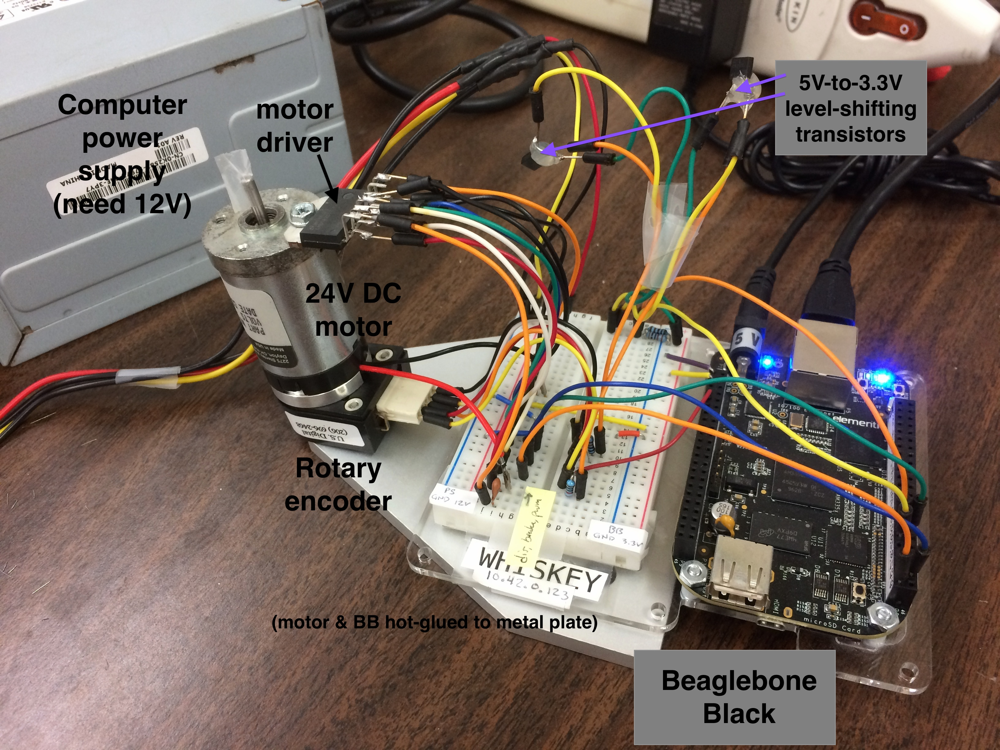

Justin's Beaglebone C I/O library (24-Volt DC Motor project)
==============================================================

This project lives on my GitHub at <https://github.com/justinpearson/Beaglebone-Motor-Demo>


Summary
---------

Here is a very simple DC motor demo for the Beaglebone Black. It reads
the motor shaft angle with a EQEP-based rotary encoder and drives the motor
with PWM through a motor driver. The motor driver draws power through
a disused desktop power supply's 12-Volt line.

The purpose of this demo is to show that **it's easy to use C to interface with the PWM, GPIO, and EQEP sysfs entries** that Beaglebone provides to access I/O from userspace. Only standard syscall functions like `open`, `close`, `read`, and `write` are needed to do I/O in C. Neato!

Some Python code is also provided for comparison. It uses the built-in Adafruit_BBIO library and [Nathaniel Lewis's eqep.py module](https://github.com/Teknoman117/beaglebot).

A lot of stuff is hard-coded for expediency. This makes it easy 
for newcomers to learn how to use C to interface with the Beaglebone's
sysfs entries, without getting bogged down with C++ classes or device-tree overlays.


Picture of setup
-----------------

Here's some pictures of the hardware.


\ 


\ 


Quick Start
--------------

### Configure Beaglebone, build, & run 

- Plug in the BB's 5V power plug. If the 4 blue LEDs don't start blinking in 5 seconds, unplug it and re-plug it.
- Then, ssh into the BB from your laptop. (The BB's IP address is hard-coded as 10.42.0.123, so make your laptop 10.42.0.2 or something.)

```bash
    ssh debian@10.42.0.123
    sudo su
    date -s "13 Dec 2013 13:43"  # or whatever
    cd Beaglebone-Motor-Demo/C
    ./run.sh
```    

The `run.sh` script does 3 things:

1. Loads the PWM, GPIO, and EQEP device-tree overlays necessary to run the demo. It essentially does

```bash
    export SLOTS=$(find /sys/devices -name slots)
    echo am33xx_pwm     > $SLOTS
    echo bone_pwm_P8_34 > $SLOTS
    echo bone_eqep1     > $SLOTS
    echo 70             > /sys/class/gpio/export
    echo 73             > /sys/class/gpio/export
```

Moreover, it also generates a header file `sysfs-paths.h` that just `#defines` the paths of the PWM, GPIO and EQEP sysfs entries so that functions in `bb-simple-sysfs-c-lib.h` can use them.

Originally, I hard-coded the sysfs paths in `bb-simple-sysfs-c-lib.h`. But it turns out that the directories sometimes change between reboots, e.g., sometimes `echo bone_pwm_P8_34 > $SLOTS` results in a directory `/sys/devices/ocp.3/pwm_test_P8_34.18/` and sometimes `/sys/devices/ocp.3/pwm_test_P8_34.12/`.

2. Compiles the library (`bb-simple-sysfs-c-lib.c/h`), tests (`tests.c`), and main (`main.c`) programs.

3. Runs `main`. 


### Handy BB commands

- Shutdown: `# shutdown -hP now`
- Reboot: `# reboot`


### Turn motor in C

```c
    #include "bb-simple-sysfs-c-lib.h"
    void main() {
      setup();
     
      printf("Shaft angle BEFORE (deg): %lf\n", shaft_angle_deg());
      duty(50); // 50% duty cycle
      cw();     // clockwise
      unstby(); // disable 'stby' GPIO on motor driver
      run();    // set 'run' sysfs entry for PWM

      sleep(1); // let it run for a sec.

      duty(0);  // set 'duty' to 0
      stop();   // turn off 'run' 
      stby();   // set 'stby' GPIO on motor driver

      printf("Shaft angle AFTER (deg): %lf\n", shaft_angle_deg());

      shutdown();
         
    }
```


### Proportional controller in C


```c

int main ( int argc, char *argv[] ) {
 
  setup();
  unstby();
  run();
  cw();

  double kp = -.015;
  double dt = 0.1;      // sec, time per iteration
  double max_time = 10; // sec, max time of sim
  int num_iters = max_time / dt;
  double freq = 1;      // Hz, controls how fast the reference angle changes

  int i=0;
  for( i=0; i<num_iters; i++ ) {
    double angle = shaft_angle_deg();
    double ref = 180 * sin(2.0 * M_PI * freq * dt * i); // deg
    double error = ref-angle;
    double v = kp * error;
    voltage(v);
    usleep(dt*1000000.0);
  }

  stop();
  stby();
  shutdown();

return 0;
}

```


Hardware setup
----------------


The hardware consists of:

- DC motor (Globe Motors 405A336) 
- Motor driver (LMD18201T)
- Rotary encoder (US Digital)
- Beaglebone Black
- Dell desktop power supply 
- 2 10-nF capacitors for motor driver
- Two 2N3906 transistors used for 5V-to-3.3V level-shifting the EQEP sensor


The wiring schematic is shown here:


\ 


In particular, note that:

- The motor driver has inputs for PWM, direction, and brake. 
- Pin P8_34 is the PWM.
- Pin P8_45 (GPIO) ctrls motor direction.
- Pin P8_44 (GPIO) ctrls motor brake (standby).
- The rotary encoder puts out 5V, but the BB's GPIOs require 3.3V; the transistor circuits perform level-shifting from 5V to 3.3V. 
- The rotary encoder's EQEP signal is read by the BBB's EQEP peripheral.


Software
----------

The file `bb-simple-sysfs-c-lib.c/h` provides a very thin C interface to the Beaglebone Black's PWM, GPIO, and EQEP sysfs entries.


For expediency, I hard-coded the sysfs entries for the PWM, two GPIOs, and
EQEP in `bb-simple-sysfs-c-lib.h`:


```c
    #define PWM_PATH           "/sys/devices/ocp.3/pwm_test_P8_34.18/"
    #define GPIO_MOTORDIR_PATH "/sys/class/gpio/gpio70/"
    #define GPIO_STBY_PATH     "/sys/class/gpio/gpio73/"
    #define EQEP_PATH          "/sys/devices/ocp.3/48302000.epwmss/48302180.eqep/"
```

If these sysfs directories don't exist, execute the following lines to create them:


```bash
    $ export SLOTS=$(find /sys/devices -name slots)
    $ echo am33xx_pwm > $SLOTS
    $ echo bone_pwm_P8_34 > $SLOTS
    $ echo bone_eqep1 > $SLOTS
    $ echo 70 > /sys/class/gpio/export
    $ echo 73 > /sys/class/gpio/export
```

Notes:

- the `slots` file on my machine lives at `/sys/devices/bone_capemgr.9/slots`.

- The Exploring Beaglebone book's Fig 6-6 shows that P8_45 (that
I connected to the motor driver's "direction" pin) is GPIO 70, and
P8_44 (I connected to "brake" / standby) is GPIO 73.

- The EQEP directory may be named slightly different; find the precise one with

```bash
    $ find /sys/devices/ -iname "*qep*"
```

- The same goes for the PWM; use `find /sys/devices/ -name duty` to find it.

- Running Python's Adafruit library wipes out the sysfs entries, e.g, Adafruit_BBIO.PWM.cleanup(), so you will have to re-echo them to recreate them.


The motor driver draws power from a Dell desktop power supply's 12V
line. I hard-coded the PWM period to 50kHz. The rotary encoder seems to have a resolution of 1500 lines per revolution:

```c
      #define MAX_VOLTAGE 11.7 // Volts, Dell desktop power supply
      #define NS_PER_PWM_PERIOD 20000 // ns per PWM period
      #define NS_PER_PWM_PERIOD_STR "20000"
      #define EQEP_PER_REV 1500 // I counted by hand, rough estimate
```


### C functions provided


- PWM
    - `stop()` / `run()`: write 0 / 1 to the "run" PWM sysfs entry
    - `rawduty(char* c, int len)`: write a string to the "duty" sysfs file: "20000" is 0% duty cycle, "0" is 100% duty cycle
    - `duty( double d )`: write 0 - 100% to the "duty" sysfs file
    - `voltage( double v)`: convert voltage v into a duty cycle & GPIO direction and change them appropriately

- GPIO
    - `stby()` / `unstby()`: set P8_44 to 1 / 0
    - `cw()` / `ccw()`: set P8_45 to 1 / 0

- EQEP
    - `int eqep_counts()`: read eqep "position" file as an int
    - `double shaft_angle_deg()`: gets eqep position and converts to degrees


Details / Notes
---------------


- Note: PWM period is set in something like `/sys/devices/ocp.3/pwm_test_P8_34.18/period` with units of "ns per PWM cycle".

- Note: in sysfs, the 'duty' file is given in ns, not %. Ex: if period is set to 20000 (ns), then duty takes value between 0 (for 100% duty cycle) to 20000 (for 0% duty cycle)

- Note: polarity is switched on pwm:

   - to do 0% duty cycle, you must write same value to 

       `/sys/devices/ocp.3/pwm_test_P8_34.18/duty` 

     as you wrote to 

       `/sys/devices/ocp.3/pwm_test_P8_34.18/period`. 

   - To get 100% duty, must write 0 to duty.


- Note: instead of using the GNU C lib functions 'fread' and 'fwrite', which may do some buffering, it is more direct to use the syscalls 'read' and 'write'.

- Note: considering using 'pread' and 'pwrite' instead of 'read' and 'write'. 'p' is for 'position', and in many examples I see folks seeking the read/write head to the beginning of the file for some reason? we need to rewind the reads (any maybe writes) to the beginning of the files each time? read/write seems to work for me, except for reading the eqep, where I use pread.


### Background: sysfs entries


The BBB uses a sysfs filesystem to provide a userspace interface to
the hardware. For example, set up a 50kHz PWM on pin P8_34 like this:

    echo bone_pwm_P8_34 > /sys/devices/bone_capemgr.9/slots (or wherever your slots are)

That creates the directory

    /sys/devices/ocp.3/pwm_test_P8_34.18/   (your .18 may be different)

with files like `duty`, `period`, and `run`. Now turn on the PWM:

     echo 20000 > period  # 20000 ns per PWM cycle => 50kHz
     echo 10000 > duty    # 50% duty cycle 
     echo 1 > run


### Hardware setup notes


cw 1 rev: eqep changes by -1450

ccw 1 rev: eqep changes by 1500

- gearbox inside?

stby low: motor turns; hi: motor stops

pwm 10%: just barely turns. stutters. sometimes stops

dir pin low: motor turns cw; high: ccw


### Sign conventions

For the `shaft_angle_deg()` and `voltage()` functions:

- ccw is positive angle
- positive motor voltage turns motor cw
- cw 1 rev => -1500 encoder ticks


### Motor specifications

- motor coil resistance: 14 ohms
- motor coil inductance: 11.52 mH
- rotary encoder: 1500 lines / rev, roughly


### Troubleshooting


The EQEP driver isn't included in the stock BBB kernel, so `echo bone_eqep1 > $SLOTS` will fail in `dmesg`; update kernel to latest with

    cd /opt/scripts/tools/
    git pull
    sudo ./update_kernel.sh
    sudo reboot

(Source: <http://elinux.org/Beagleboard:BeagleBoneBlack_Debian> )

Now you should have 

    # find /lib/firmware -iname "*qep*"
    /lib/firmware/bone_eqep0-00A0.dtbo
    /lib/firmware/bone_eqep1-00A0.dtbo
    /lib/firmware/bone_eqep2b-00A0.dtbo
    /lib/firmware/bone_eqep2-00A0.dtbo

My `uname -a` shows:

    Linux beaglebone 3.8.13-bone81 #1 SMP Fri Oct 14 16:04:10 UTC 2016 armv7l GNU/Linux


Make a shell variable `SLOTS` pointing to your `slots` file that organizes your DTOs:

    $ export SLOTS=$(find /sys/devices -name slots)

On my BB, `$SLOTS` is `/sys/devices/bone_capemgr.9/slots`. 

Load Device Tree Overlays:

    $ echo am33xx_pwm > $SLOTS
    $ echo bone_pwm_P8_34 > $SLOTS
    $ echo bone_eqep1 > $SLOTS
    

Have them added automatically by adding to `/boot/uboot/uEnv.txt`:

    optargs=capemgr.disable_partno=BB-BONELT-HDMI,BB-BONELT-HDMIN \
       capemgr.enable_partno=BB-ADC,bone_pwm_P8_34,am33xx_pwm,bone_eqep1


